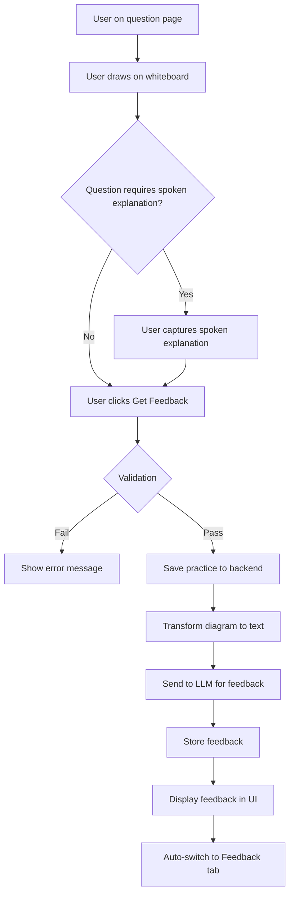

# AI Feedback System PRD

**Document Type:** Feature Product Requirements Document  
**Feature:** AI Feedback Generation for Practice Submissions  

See [Foundation PRD](00-foundation.md) for data models and infrastructure. Uses output from [Audio Recording](03-audio-recording.md).

**Version:** 2.1  
**Date:** April 14, 2026  
**Status:** Draft  

---

## 1. Feature Overview

The AI Feedback System enables users to receive AI-generated evaluation and feedback on their system design practice submissions. When a user completes their whiteboard diagram (and spoken explanation transcript for High Level Design and Deep Dive questions) and clicks "Get Feedback", the system:

1. Validates the submission (whiteboard content required; spoken explanation optional in V1)
2. Saves the practice to the backend
3. Transforms diagram JSON to structured text for LLM consumption
4. Constructs an evaluation prompt with question context, diagram description, and combined spoken transcript
5. Sends the prompt to an LLM API (OpenAI/Anthropic)
6. Parses and stores the feedback
7. Returns feedback to the frontend for display

The system supports edit-and-resubmit workflows: users can improve their answers and request new feedback, with each submission creating a new **`PracticeFeedback`** record while preserving history in the database.

**Data model note:** Resubmit uses the **same canonical `practice_id`** per `(practice_main_id, question_id)` for that session. Multiple submissions do **not** create multiple active **`Practice`** rows for the same question in the same session; history is carried by **`PracticeFeedback`** (and optional history tables). See Foundation PRD and Practice Session Management backend PRD for the unique constraint on `Practice`.

**Progress, score, and transcript (this PRD):** How **session progress indicators** (progress dots) relate to **`PracticeFeedback`** versus draft work is defined in **§2.5**. How **feedback score is mapped to label + color** is defined in **§2.4**. How **spoken transcript** is derived and passed into the LLM is defined in **§2.6**.

---

## 2. Practice Submission and Feedback

### 2.1 Submit Practice
**Priority:** P0 (Must Have)

**User Story:**  
As a user, when I click "Get Feedback", the system should save my whiteboard content and spoken explanation transcript, then return AI-generated feedback.

**Acceptance Criteria:**
- Validation:
  - Whiteboard content must not be empty for active section
  - Spoken explanation is optional in V1 for High Level Design/Deep Dive questions
- On click:
  - Show loading spinner
  - Submit practice data
  - Display feedback in Feedback tab
  - Auto-switch to Feedback tab
- Feedback includes:
  - Text evaluation
  - Specific suggestions
  - Score-derived grade label and performance color

**API Request:**
```
POST /api/v1/practices/{practice_id}/feedbacks
Headers:
- Idempotency-Key: <optional UUID/string>

Request Body:
{
  "whiteboard_content": { /* JSONB structure */ }
}
```

**API Response:**
```
{
  "practice_id": 123,
  "feedback": {
    "practice_feedback_id": 999,
    "feedback_text": "Your functional requirements are well-defined...",
    "score": 85.5,
    "grade_label": "Strong",
    "grade_color": "score_strong_green",
    "generated_at": "2026-02-13T10:30:00Z"
  }
}
```

### 2.2 AI Feedback Generation
**Priority:** P0 (Must Have)

**Process:**
1. Backend receives practice submission
2. Transform diagram JSON to structured text description
3. Construct LLM prompt with:
   - Question context
   - Diagram description
   - Combined spoken transcript (server-derived from persisted transcript segments—see **§2.6**)
   - Evaluation criteria
4. Send to LLM API (OpenAI/Anthropic)
5. Parse and store feedback
6. Return to frontend

**Diagram to Text Transformation:**
```python
def diagram_to_text(section_data):
    elements = section_data['elements']
    description = []
    
    # Extract components
    for elem in elements:
        if elem['type'] in ['rectangle', 'circle']:
            text = elem.get('text', 'Unnamed')
            description.append(f"- Component: {text}")
    
    # Extract connections
    arrows = [e for e in elements if e['type'] == 'arrow']
    for arrow in arrows:
        label = arrow.get('label', '')
        description.append(f"- Connection: {arrow['startElementId']} -> {arrow['endElementId']} ({label})")
    
    # Extract annotations
    texts = [e for e in elements if e['type'] == 'text']
    for text in texts:
        description.append(f"- Note: {text['text']}")
    
    return "\n".join(description)
```

**LLM Prompt Template:**
```
You are evaluating a system design answer for the following question:

Question Type: {question_type}
Question: {question_description}

User's Diagram:
{diagram_text_description}

Spoken Explanation Transcript (if provided):
{combined_transcript}

Please provide constructive feedback covering:
1. Completeness: Are all necessary components included?
2. Correctness: Are the components and connections appropriate?
3. Clarity: Is the design clearly communicated?
4. Best Practices: Does it follow system design best practices?
5. Improvements: What could be added or changed?

Provide a score from 0-100 and detailed textual feedback.
```

**Performance Requirements:**
- Feedback generation time: < 30 seconds for text-only
- Feedback generation time: < 45 seconds with spoken explanation transcript
- Fallback if LLM service fails: "Feedback temporarily unavailable, please try again"

### 2.3 Edit and Resubmit
**Priority:** P0 (Must Have)

**User Story:**  
After receiving feedback, I want to improve my answer and get new feedback.

**Acceptance Criteria:**
- After feedback displayed, user can still edit whiteboard
- Clicking "Get Feedback" again submits updated content
- Updates existing Practice record (same practice_id)
- Creates new PracticeFeedback record
- Feedback history preserved in database
- UI shows latest feedback only

### 2.4 Feedback score grading model (label + color only)

The backend computes a numeric score (`0-100`) for each generated feedback and deterministically maps it to a grade label and semantic color token. The frontend displays **label + color only** for performance state and must not display the numeric score in V1.

**Grade bands (fixed width: 20 points):**

| Score Range | Grade Label | Grade Color Token |
|-------------|-------------|-------------------|
| 0-19 | Needs Improvement | `score_needs_improvement_red` |
| 20-39 | Below Expectations | `score_below_expectations_orange` |
| 40-59 | Developing | `score_developing_yellow` |
| 60-79 | Good | `score_good_blue` |
| 80-100 | Strong | `score_strong_green` |

**Rules:**
- Mapping must be deterministic and stable across retries/resubmits.
- Boundary values map exactly as defined above (for example: `19`, `20`, `39`, `40`, `79`, `80`, `100`).
- `grade_label` and `grade_color` are required in successful feedback API responses.
- If score or grade derivation fails, return `500` and do not persist a partial `PracticeFeedback` row.

### 2.5 Session progress and `PracticeFeedback`

This subsection ties **Get Feedback** to **session chrome** (progress dots) and the **`GET /api/v1/practice-main`** contract. Full UX copy lives in [Practice Session Management](01-practice-session-management.md) §3.1.2; API field semantics in [Practice Session Management – Backend](backend/01-practice-session-management.md) §1.1.

**Definition:** For an active practicing session, a question **counts toward progress** (blue progress dot) when there exists at least one **`PracticeFeedback`** row whose **`practice_id`** belongs to a **`Practice`** row with this **`practice_main_id`** and that **`question_id`**. The active session response exposes this as **`question_ids_with_feedback`**: distinct **`question_id`** values satisfying the above.

**Not sufficient for progress (grey dot unchanged):**

- Idempotent **create-or-get `Practice`** for a question (e.g. to obtain **`practice_id`** for transcript segment uploads)
- Persisted **`PracticeTranscriptSegment`** rows alone
- **`PracticeMain.whiteboard_content`** autosave alone

**Sufficient event:** A successful **Get Feedback** flow (this PRD’s submit path) that **persists at least one `PracticeFeedback`** row for that question’s **`practice_id`**.

**Resubmits:** The client reuses the same canonical **`practice_id`**. Each successful feedback run **appends** a new **`PracticeFeedback`** row. **`question_ids_with_feedback`** remains a set of distinct question IDs—the question stays listed once even after multiple feedback generations.

**Cross-references:** [Audio Recording](03-audio-recording.md) defines segment storage and upload APIs only; it does **not** define progress dots. Progress dots follow **`question_ids_with_feedback`**, not **`Practice` row existence alone** (see [Audio Recording – Backend](backend/03-audio-recording.md) where applicable).

**Backend alignment:** Introducing the active **`practice_feedback`** table (per [Foundation](00-foundation.md)), returning **`question_ids_with_feedback`** on **GET practice-main** (replacing any interim **`question_ids_with_practices`**-style field), and **archiving feedback to `practice_feedback_history` on session complete** are **in scope for this feature’s implementation**—not a separate “progress-only” milestone. They ship together with persisting **`PracticeFeedback`** on Get Feedback.

### 2.6 Spoken transcript as server-side LLM input

**Source of truth:** **`combined_transcript`** and duration aggregates for the LLM are derived only from persisted **`PracticeTranscriptSegment`** rows for the submit **`practice_id`**, as specified in [Audio Recording](03-audio-recording.md) and [Audio Recording – Backend](backend/03-audio-recording.md).

**Server responsibility:** The backend loads segments in **`segment_order`**, applies the same concatenation and duration rules used elsewhere (e.g. validation endpoints), and builds the transcript block for the evaluation prompt. The client **must not** send **`combined_transcript`** or **`total_duration_seconds`** on **`POST /api/v1/practices/{practice_id}/feedbacks`** (see §4.1); the server does not treat ad-hoc client transcript fields as authoritative when they bypass persisted segments.

**Validation before LLM:**

- For questions with **`requires_spoken_explanation`**: enforce segment presence and quality per the Audio PRDs before calling the LLM (reject or return **400** with a clear message when requirements are not met).
- For optional spoken explanation (V1): if there are no segments, the prompt uses an **empty or explicitly optional** transcript slot as defined in the prompt template.

**Prompt contract:** Every evaluation prompt includes question context, diagram-derived text (from the submitted whiteboard payload), and a **combined transcript** section. That section may be empty when speech is optional; it must still appear in the template so the model’s instructions stay stable.

---

## 3. Practice and Submit Flow



---

## 4. API Specification

### 4.1 Submit Feedback (Create `PracticeFeedback`)

```
POST /api/v1/practices/{practice_id}/feedbacks
Idempotency-Key: <optional UUID/string>

Request Body:
{
  "whiteboard_content": {
    "section_1": {
      "type": "diagram",
      "version": "1.0",
      "elements": [...]
    },
    ...
  }
}

Notes:
- Client must not send `combined_transcript` or `total_duration_seconds` in this request.
- Backend computes transcript aggregates from persisted transcript segments by `practice_id` (full contract: **§2.6**).
- `practice_id` is the canonical per-question row obtained via `GET/POST /api/v1/practice-main/{practice_main_id}/practices`.
- `Idempotency-Key` is optional. When present, duplicate requests with the same key from the same caller within a short dedupe window should return the original successful response instead of creating an additional `PracticeFeedback`.
- Backend must return `grade_label` and `grade_color` for every successful feedback generation.
- Frontend performance display in V1 must use `grade_label` + `grade_color` only (do not render numeric score).

Response (200 OK):
{
  "practice_id": 789,
  "feedback": {
    "practice_feedback_id": 999,
    "feedback_text": "Your solution demonstrates...",
    "score": 85.5,
    "grade_label": "Strong",
    "grade_color": "score_strong_green",
    "generated_at": "2026-02-13T10:05:00Z"
  },
  "submitted_at": "2026-02-13T10:05:00Z"
}

Error Responses:
- 400 Bad Request (validation failed)
- 404 Not Found (invalid `practice_id`)
- 409 Conflict (same `Idempotency-Key` reused with different payload)
- 500 Internal Server Error
```

### 4.2 Deprecation note (`POST /api/v1/practice`)

- `POST /api/v1/practice` is deprecated.
- Use `POST /api/v1/practice-main/{practice_main_id}/practices` for idempotent create-or-get of canonical `practice_id`.
- Use `POST /api/v1/practices/{practice_id}/feedbacks` to generate and persist `PracticeFeedback`.

---

## 5. AI Integration

**LLM Service:**
- Provider: OpenAI GPT-4 or Anthropic Claude 3
- Timeout: 60 seconds
- Retry: 2 attempts with exponential backoff
- Fallback: Queue for later processing if service unavailable

**Speech Transcript Input:**
- See **§2.6** for source of truth, validation, and prompt usage.
- Summary: Persisted transcript segments, combined server-side by `practice_id` during `POST /api/v1/practices/{practice_id}/feedbacks`.
- Languages: English (initial), expand later
- Constraint: Quality depends on frontend speech recognition accuracy

**Cost Management:**
- Token usage tracking per request
- Budget alerts
- Rate limiting per user (10 feedback requests per hour)

---

## 6. AI Service Failures

**LLM Timeout:**
- Retry once after 30 seconds
- If still fails: "Feedback generation is taking longer than expected. We'll email you when it's ready."
- Queue for background processing

**LLM Service Down:**
- Display: "Feedback service temporarily unavailable. Please try again in a few minutes."
- Action: Save practice, allow user to continue to next question
- Background: Retry every 5 minutes for 1 hour

**Invalid LLM Response:**
- Fallback: Generic feedback based on question type
- Log: Alert engineering team
- Display: "Feedback generated with limited detail. Our team is working to improve this."

---

## 7. Open Questions (AI Service)

1. **AI Service Selection:** OpenAI GPT-4 vs Anthropic Claude 3? Cost-benefit analysis needed.
2. **Speech Transcript Quality:** Is browser speech recognition accuracy sufficient for all supported browsers in V1?
3. **Feedback Scoring evolution:** Should future versions expose numeric score in UI, or keep label+color-only permanently?

---

## 8. Testing Scenarios

**Feedback Generation:**
- 20. User submits practice → Feedback generated within 30 seconds
- 21. User submits with spoken explanation → Feedback incorporates transcript-based evaluation
- 22. LLM service fails → Graceful error message, retry option
- 23. User edits and resubmits → New feedback generated, old preserved in DB
- 24. Feedback response includes `grade_label` and `grade_color` on every successful feedback generation
- 25. UI shows performance using label+color only (numeric score is not displayed)
- 26. Grade boundary mapping is correct: `19->Needs Improvement`, `20->Below Expectations`, `39->Below Expectations`, `40->Developing`, `59->Developing`, `60->Good`, `79->Good`, `80->Strong`, `100->Strong`
- 27. If score/grade derivation fails, backend returns `500` and does not persist a partial `PracticeFeedback` row

**Edge Cases:**
- 28. Very long feedback text → Scrollable, properly formatted

---

## Appendix B: Sample LLM Prompt

```
System: You are an expert system design interviewer providing constructive feedback.

User Question Type: Functional Requirements
Question: Define the core functional requirements for designing Twitter.

User's Diagram Description:
- Component: User Registration and Authentication
- Component: Tweet Creation (text, images, videos)
- Component: Following/Unfollowing Users
- Component: Timeline/Feed Generation
- Component: Likes and Retweets
- Connection: Users -> Tweets (creates)
- Connection: Users -> Following (relationship)
- Note: Support for 280 character limit
- Note: Real-time updates for feed

Evaluate this answer on:
1. Completeness: Are all major functional requirements covered?
2. Clarity: Is the description clear and well-organized?
3. Correctness: Are the requirements appropriate for a Twitter-like system?
4. Detail Level: Is there sufficient detail without over-engineering?
5. Missing Elements: What important requirements might be missing?

Provide:
- A numerical score from 0-100
- Detailed textual feedback with specific suggestions for improvement
- Highlight what was done well
- Identify gaps or areas for improvement
```
