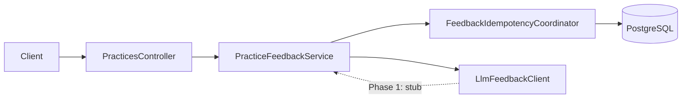

# AI Feedback System – Backend (Phase 1)

This document is the **backend engineering specification** for AI feedback submit, persistence, idempotency, and session progress. It **does not replace** the product PRD; UX, acceptance criteria, and high-level behavior remain authoritative in [`resource/prds/04-ai-feedback-system.md`](../04-ai-feedback-system.md).

**Aligned references:** [Foundation PRD](../00-foundation.md) (shared models), [Practice Session Management – Backend](01-practice-session-management.md) (canonical `practice_id`, create-or-get), [Audio Recording – Backend](03-audio-recording.md) (transcript segments as input to feedback). **Version note:** Tracks product PRD **§4.1** (required `Idempotency-Key`, durable idempotency, timeouts).

---

## 1. Scope

### 1.1 In scope

- `POST /api/v1/practices/{practice_id}/feedbacks` — validation, orchestration, response mapping.
- Persistence of `PracticeFeedback` and `PracticeFeedbackRequest` (idempotency), including `UNIQUE (user_id, idempotency_key)`.
- Server-side **input fingerprint** from persisted whiteboard section JSON + ordered transcript segments.
- Diagram-to-text and merged transcript assembly from persisted state only (no client-supplied diagram or transcript on this endpoint).
- API-only **`grade_label`** / **`grade_color`** derived from stored numeric **`score`** (see §7).
- **`question_ids_with_feedback`** on active practice main load (per product **§2.5**), backed by distinct `question_id` values that have at least one `PracticeFeedback` in the session.

### 1.2 Out of scope / deferred

- Non-local provider implementation parity details beyond the profile contract in §8 (Phase 1 keeps **`StubLlmFeedbackClient`** available as a fallback implementation of **`LlmFeedbackClient`**).
- Async queue-only completion if the product later defers synchronous HTTP response (current design completes in-request after claim).
- Dedicated UI work for numeric score (product: V1 uses label + color only).

---

## 2. Integration overview

**Dependencies**

- **`PracticeRepository.findWithMainAndQuestionById`** — loads `Practice` with `PracticeMain` and `Question` (user id, whiteboard JSON, section index, `requires_recording`).
- **`PracticeTranscriptSegmentRepository.findByPractice_PracticeIdOrderBySegmentOrderAsc`** — ordered segments for fingerprint + transcript text.
- **`PracticeMain.whiteboard_content`** — authoritative diagram JSON; active section selected via `question.whiteboard_section`.
- Canonical **`practice_id`** — obtained via create-or-get in [Practice Session Management – Backend](01-practice-session-management.md).

---

## 3. Data model (backend)

Schema: [`src/main/resources/db/migration/V9__Create_practice_feedback_and_idempotency.sql`](../../../src/main/resources/db/migration/V9__Create_practice_feedback_and_idempotency.sql).

### 3.1 `practice_feedback`

| Column | Notes |
|--------|--------|
| `practice_feedback_id` | PK |
| `practice_id` | FK → `practice` |
| `feedback_text` | LLM output text |
| `score` | `DOUBLE PRECISION`, 0–100 (enforced in grade mapper at response boundary) |
| `generated_at` | Timestamp |

Index: `idx_practice_feedback_practice_id` on `practice_id`.

### 3.2 `practice_feedback_request` (idempotency)

| Column | Notes |
|--------|--------|
| `practice_feedback_request_id` | PK |
| `user_id` | Owner scope (from `practice_main.user_id`) |
| `idempotency_key` | Client-supplied string, max **128** chars (DB + service validation) |
| `practice_id` | FK → `practice` (binds key to this submit target) |
| `input_fingerprint` | SHA-256 hex string (64 chars) over practice id + section JSON + segment material |
| `status` | `CLAIMED` \| `COMPLETED` \| `FAILED` (see [`PracticeFeedbackRequestStatus`](../../../src/main/java/com/hellointerview/backend/entity/PracticeFeedbackRequestStatus.java)) |
| `practice_feedback_id` | Set when `COMPLETED`; cleared on some failure paths |
| `error_code` | e.g. `llm_timeout`, `claim_abandoned` |
| `created_at`, `updated_at`, `expires_at` | `expires_at` default **72h** from row creation if unset ([`PracticeFeedbackRequest`](../../../src/main/java/com/hellointerview/backend/entity/PracticeFeedbackRequest.java) `@PrePersist`) |

**Constraints**

- **`UNIQUE (user_id, idempotency_key)`** — one logical attempt row per user + key.
- Index **`(practice_id, status)`** for operational queries.

**Relationship:** One `Practice` has many `PracticeFeedback` rows (history). The idempotency row is **per submit attempt** (per `Idempotency-Key`), not per `practice_id`.

---

## 4. API specification

**Endpoint:** `POST /api/v1/practices/{practice_id}/feedbacks`  
**Controller:** [`PracticesController`](../../../src/main/java/com/hellointerview/backend/controller/PracticesController.java)  
**Service:** [`PracticeFeedbackService`](../../../src/main/java/com/hellointerview/backend/service/PracticeFeedbackService.java)

### 4.1 Headers

| Header | Required | Rules |
|--------|----------|--------|
| `Idempotency-Key` | **Yes** | Non-empty after trim; max **128** characters. Missing header → **400** (Spring `MissingRequestHeaderException`, mapped by [`GlobalExceptionHandler`](../../../src/main/java/com/hellointerview/backend/exception/GlobalExceptionHandler.java)). Null/blank after trim (e.g. whitespace-only) → **400** via `BadRequestException` in service. |

### 4.2 Body

- **`{}`** or omitted body (empty JSON object).  
- **Non-empty JSON object** → **400** `BadRequestException`: *Request body must be empty for this endpoint*.

### 4.3 Success response

**200 OK** — [`FeedbackSubmitResponseDto`](../../../src/main/java/com/hellointerview/backend/dto/FeedbackSubmitResponseDto.java): `practice_id`, nested `feedback` ([`FeedbackPayloadDto`](../../../src/main/java/com/hellointerview/backend/dto/FeedbackPayloadDto.java): ids, text, numeric `score`, `grade_label`, `grade_color`, `generated_at`), and **`submitted_at`** (currently same instant as persisted feedback `generated_at` per [`FeedbackSubmitResponseMapper`](../../../src/main/java/com/hellointerview/backend/service/feedback/FeedbackSubmitResponseMapper.java)).

### 4.4 Errors (summary)

| HTTP | When | `code` (if any) |
|------|------|-----------------|
| **400** | Missing/blank/oversized `Idempotency-Key`; empty whiteboard section for mapped `section_N`; question `requires_recording` and zero segments; non-empty body; JSON serialization failure for fingerprint input | — |
| **404** | Unknown `practice_id` | — |
| **409** | Idempotency conflict: wrong `practice_id` for key, expired key, fingerprint mismatch on completed/in-flight row per coordinator rules | — |
| **503** | In-flight same key + fingerprint (`FeedbackInProgressException`) | `feedback_in_progress`; **`Retry-After`** header (seconds) |
| **503** | LLM outbound timeout (`LlmTimeoutException`) | `llm_timeout` |
| **500** | Non-finite LLM score at finalize, or score/grade mapping failure when building the response (product **§2.4**) — [`GradeMappingException`](../../../src/main/java/com/hellointerview/backend/exception/GradeMappingException.java) via [`GlobalExceptionHandler`](../../../src/main/java/com/hellointerview/backend/exception/GlobalExceptionHandler.java) | `grade_mapping_failed` |

Error envelope: [`ErrorResponse`](../../../src/main/java/com/hellointerview/backend/exception/ErrorResponse.java) — `error`, `message`, optional `code`, optional `details`.

---

## 5. Core processing flow

**Transaction boundary:** [`PracticeFeedbackService.submitFeedback`](../../../src/main/java/com/hellointerview/backend/service/PracticeFeedbackService.java) is **not** annotated with `@Transactional`. Database writes run only inside [`FeedbackIdempotencyCoordinator`](../../../src/main/java/com/hellointerview/backend/service/feedback/FeedbackIdempotencyCoordinator.java) methods, each of which opens and commits its own transaction, so the LLM step does not hold a DB transaction open.

Ordered steps in **`PracticeFeedbackService.submitFeedback`**:

1. **Normalize `Idempotency-Key`** (fail fast before DB reads for null/blank).
2. **Load practice** — 404 if missing.
3. **Load transcript segments** for `practice_id`, ordered.
4. **`validateRecordingIfRequired`** — if `question.requiresRecording` and no segments → 400.
5. **Resolve whiteboard section** — `section_{whiteboardSection}` on `PracticeMain.whiteboard_content`; **empty `elements` list** → 400.
6. **Fingerprint** — [`FeedbackInputFingerprint.compute`](../../../src/main/java/com/hellointerview/backend/service/feedback/FeedbackInputFingerprint.java) over `practice_id`, canonical JSON of the section map, and each segment’s order, duration, and transcript text hash code.
7. **Diagram text** — [`DiagramToTextConverter.diagramToText`](../../../src/main/java/com/hellointerview/backend/service/feedback/DiagramToTextConverter.java) on the section map.
8. **Combined transcript** — [`TranscriptAggregation.buildCombinedTranscript`](../../../src/main/java/com/hellointerview/backend/service/TranscriptAggregation.java).
9. **Build `LlmFeedbackInput`** — question type label, description, diagram text, transcript.
10. **Idempotency** — [`FeedbackIdempotencyCoordinator.claimOrInsert`](../../../src/main/java/com/hellointerview/backend/service/feedback/FeedbackIdempotencyCoordinator.java) (short transaction).
11. **Branch on claim result** — `Replay` → return DTO; `Conflict` → 409; `InProgress` → 503 + retry-after; `Proceed` → call LLM.
12. **LLM** — **`LlmFeedbackClient.generate`** **outside** a transaction holding the claim (claim already committed).
13. **Finalize** — `finalizeSuccessful` writes `PracticeFeedback` and marks request `COMPLETED` in a **separate** transaction from the claim insert (per product **§4.1.2**).

### 5.1 Idempotency state machine (implementation)

Implemented in **`FeedbackIdempotencyCoordinator`**:

- **New key:** insert row `CLAIMED` with fingerprint; unique violation → reload and **`handleExisting`** (concurrent first insert).
- **`COMPLETED` + same fingerprint:** return **`Replay`** (DTO from linked `PracticeFeedback`, no LLM).
- **`COMPLETED` + different fingerprint:** **`Conflict`**.
- **`CLAIMED` + stale** (created older than **15 minutes**, constant `STALE_CLAIM_AFTER_MINUTES`): transition to **`FAILED`** / `claim_abandoned`, then continue evaluation.
- **`CLAIMED` + same fingerprint:** **`InProgress`** → 503 `feedback_in_progress`.
- **`FAILED` + same fingerprint:** reclaim — set `CLAIMED`, clear error, return **`Proceed`** with same request id so LLM can run again.

**Transactions:** Claim insert and finalize/fail updates use `@Transactional` on coordinator methods; LLM call is **not** wrapped with those transactions.

### 5.2 Failure taxonomy and retry ownership contract

**Retry ownership (V1 synchronous):**

- Backend is the primary retry owner for transient provider failures.
- Retry budget is bounded to avoid amplification and long-tail latency; target contract is **2 provider attempts total per submit intent**.
- Client retries are only for transport/API uncertainty and must reuse the same `Idempotency-Key`.

**Failure classification matrix:**

| Provider/transport outcome | Class | Server retries provider call? | Idempotency request status | API behavior |
|---------------------------|-------|-------------------------------|----------------------------|--------------|
| Network timeout / connect reset | Transient | Yes (within bounded budget) | Keep `CLAIMED` during retries; `FAILED` if budget exhausted | `503` `llm_timeout` (or equivalent transient code) after exhaustion |
| Provider `5xx` | Transient | Yes (within bounded budget) | Keep `CLAIMED` during retries; `FAILED` if budget exhausted | `503` temporary unavailable after exhaustion |
| Provider `429` | Transient throttling | Yes (within bounded budget) | Keep `CLAIMED` during retries; `FAILED` if budget exhausted | `503` temporary unavailable; include `Retry-After` when available |
| Provider `400/422` | Terminal request/prompt | No | Transition to `FAILED` immediately | Return non-retriable failure (mapped via existing error envelope) |
| Provider `401/403` | Terminal auth/config | No | Transition to `FAILED` immediately | Return non-retriable failure; emit operational alert |

**Backoff and timeout envelope:**

- Retry delay uses exponential backoff with jitter.
- If provider returns `Retry-After` (notably for `429`), backend should honor it when compatible with end-to-end API timeout budget.
- If honoring provider `Retry-After` would violate API timeout budget, fail the current attempt and rely on client retry with the same idempotency key.

**`Retry-After` propagation:**

- For `feedback_in_progress`, always return `Retry-After` guidance.
- For transient provider exhaustion (especially `429`), include `Retry-After` when a reasonable server-computed wait is available.

---

## 6. Grading and response mapping

- **Storage:** `practice_feedback.score` only.
- **Persisted score:** [`FeedbackIdempotencyCoordinator.finalizeSuccessful`](../../../src/main/java/com/hellointerview/backend/service/feedback/FeedbackIdempotencyCoordinator.java) clamps **finite** LLM scores into **[0, 100]** before insert. **NaN** / **infinite** scores throw [`GradeMappingException`](../../../src/main/java/com/hellointerview/backend/exception/GradeMappingException.java) (no `PracticeFeedback` row); [`PracticeFeedbackService`](../../../src/main/java/com/hellointerview/backend/service/PracticeFeedbackService.java) then marks the idempotency row **`FAILED`** with `error_code` **`grade_mapping_failed`** so the client may retry per the `FAILED` policy.
- **API:** [`FeedbackGradeMapper.fromScore`](../../../src/main/java/com/hellointerview/backend/service/feedback/FeedbackGradeMapper.java) produces `grade_label` and `grade_color` for [`FeedbackPayloadDto`](../../../src/main/java/com/hellointerview/backend/dto/FeedbackPayloadDto.java). Invalid stored scores throw **`GradeMappingException`** → **500** / `grade_mapping_failed` (product **§2.4**). Bands (floor of score): 0–19, 20–39, 40–59, 60–79, 80–100 with labels/colors defined in code (align with product **§2.4** for UX; exact strings are code-owned).

---

## 7. Progress integration

**Field:** `question_ids_with_feedback` on **`GET`** practice main (see [Practice Session Management – Backend](01-practice-session-management.md)).

**Implementation:** [`PracticeMainService.getQuestionIdsWithFeedback`](../../../src/main/java/com/hellointerview/backend/service/PracticeMainService.java) delegates to [`PracticeFeedbackRepository.findDistinctQuestionIdsWithFeedbackByPracticeMainId`](../../../src/main/java/com/hellointerview/backend/repository/PracticeFeedbackRepository.java) — JPQL `distinct` `question_id` for all `PracticeFeedback` whose `practice.practiceMain` matches the session. Matches product **§2.5** (dot counts feedback received, not draft-only state).

### 7.1 Session complete: `practice_feedback_history`

When an active session is completed ([`PracticeMainService.archiveAndDeleteActivePracticeMain`](../../../src/main/java/com/hellointerview/backend/service/PracticeMainService.java)), after **`practice_history`** rows are saved, all active **`PracticeFeedback`** rows for session practices are copied into **`practice_feedback_history`** via [`PracticeFeedbackHistoryRepository.saveAll`](../../../src/main/java/com/hellointerview/backend/repository/PracticeFeedbackHistoryRepository.java) (FK to `practice_history.practice_id` per [V5 migration](../../../src/main/resources/db/migration/V5__Create_practice_history_tables.sql)), then **`practice_main`** is deleted (CASCADE removes active practices and their feedback).

**Known limitation:** There is **no** `practice_feedback_request_history` table; **`practice_feedback_request`** rows are still removed with CASCADE when the active **`practice`** row is deleted. Retry metadata for completed sessions is not retained in V1.

---

## 8. LLM integration (profile-based provider contract)

| Piece | Role |
|--------|------|
| [`LlmFeedbackClient`](../../../src/main/java/com/hellointerview/backend/service/feedback/LlmFeedbackClient.java) | Interface: `generate(LlmFeedbackInput)` may throw **`LlmTimeoutException`**. |
| [`StubLlmFeedbackClient`](../../../src/main/java/com/hellointerview/backend/service/feedback/StubLlmFeedbackClient.java) | Fallback bean when `ai.llm.provider=stub` (or unset). |
| [`OllamaLlmFeedbackClient`](../../../src/main/java/com/hellointerview/backend/service/feedback/OllamaLlmFeedbackClient.java) | Local profile provider when `ai.llm.provider=ollama`; posts to `/api/generate`, enforces JSON response contract (`feedback_text`, `score`), and applies bounded retries for transient failures. |
| Gemini provider client (dev profile) | Dev profile provider when `ai.llm.provider=gemini`; calls Gemini API and enforces the same JSON response contract (`feedback_text`, `score`) and bounded retry behavior. |
| [`OllamaLlmProperties`](../../../src/main/java/com/hellointerview/backend/service/feedback/OllamaLlmProperties.java) | Typed config for base URL, model, timeout, retry count, and backoff/jitter. |

### 8.0 Provider selection and environment contract

- `ai.llm.provider` selects implementation (`stub`, `ollama`, or `gemini`).
- Environment/profile mapping:
  - local profile default provider: `ollama`
  - dev profile provider: `gemini`
- `ai.llm.ollama.*` config controls runtime behavior:
  - `base-url`, `model`
  - `connect-timeout`, `read-timeout`
  - `max-attempts` (default 2)
  - `initial-backoff`, `backoff-multiplier`, `max-jitter-millis`
- `ai.llm.gemini.*` config controls dev-profile runtime behavior (for example API endpoint/key, model, timeouts, and retry/backoff settings).
- Timeout outcomes are still mapped to `LlmTimeoutException` and handled as `llm_timeout`.
- Non-timeout provider failures (including Ollama and Gemini) are classified as:
  - transient: `llm_transient_failure` (503)
  - terminal: `llm_terminal_failure` (500)
- Both failure classes are marked `FAILED` in `practice_feedback_request` before HTTP response is returned.

### 8.1 Future: circuit breaker integration (non-V1)

- Circuit breaker is a future reliability enhancement, not a Phase 1 requirement.
- Intended integration point: wrap provider calls inside `LlmFeedbackClient` implementation.
- State model (future): `closed` (normal calls), `open` (fail fast without provider call), `half_open` (limited probes to test provider recovery).
- While breaker is `open`, backend should fail fast with a stable temporary-unavailable response and keep idempotency semantics intact (`FAILED` for attempted submit, same-key retry allowed after cooldown).
- Thresholds (error rate, consecutive failures, cooldown/probe sizing) are implementation-defined and should be finalized using production telemetry.

---

## 9. LLM provider observability (Phase 1)

This section defines provider-path observability for `LlmFeedbackClient` implementations (`ollama`, `gemini`) so operators can distinguish provider degradation, retry behavior, and local service bottlenecks while preserving idempotency and API error semantics from §5.2 and §8.

### 9.1 Problem analysis

- User-visible promise: feedback submit remains within product latency targets and fails predictably when provider conditions are poor.
- Pressure shape: burst submits, provider tail latency, and transient provider throttling (`429`) can increase in-flight request age.
- Failure to prevent: high timeout/error rate without clear cause, retries that inflate latency/cost but do not improve success rate, and inability to separate provider issues from local API issues.

### 9.2 Service objective model (provider path)

- **SLA (external):** governed by API contract in §4.
- **SLO ownership:** Backend team owns provider-path SLO targets and incident acceptance decisions.
- **SLO (internal, production):**
  - Provider-path latency: `llm_provider_call_latency_ms` p95 <= 8s and p99 <= 20s over 10-minute windows.
  - Provider success ratio: `llm_provider_success_rate` >= 99.0% over 30-minute windows.
  - Retry exhaustion ratio: `llm_provider_retry_exhausted_rate` <= 1.0% over 30-minute windows.
- **Non-production environments:** dev/local are best-effort for observability signal quality and are not SLO-governed.
- **SLI observation points:**
  - before provider call attempt,
  - after provider response and failure classification,
  - after retry loop terminates.
- **Indicator classes:**
  - hard reliability signals: timeout rate, retry exhaustion rate, terminal provider failure rate,
  - early warning signals: `429` rate, p99 latency drift, in-flight provider calls.

### 9.3 Metrics contract

Emit application metrics from provider client implementations and the shared retry abstraction, with consistent tags: `provider`, `model`, `attempt`, `outcome`, `failure_class`.

Canonical `failure_class` vocabulary is fixed for metrics/logs/traces:

- `timeout`
- `transient`
- `transient_throttle`
- `terminal_request`
- `terminal_auth_config`
- `network`
- `parse`

Core metrics:

- `llm_provider_calls_total` (counter)
  - tags: `provider`, `model`, `outcome=success|failure`
- `llm_provider_call_latency_ms` (histogram)
  - tags: `provider`, `model`, `attempt`, `outcome`
- `llm_provider_failures_total` (counter)
  - tags: `provider`, `model`, `failure_class=timeout|transient|transient_throttle|terminal_request|terminal_auth_config|network|parse`
- `llm_provider_http_status_total` (counter)
  - tags: `provider`, `model`, `http_status_group=2xx|4xx|5xx`, `status_code`
- `llm_provider_retry_attempts_total` (counter)
  - tags: `provider`, `model`, `trigger=timeout|5xx|429|network`
- `llm_provider_retry_outcome_total` (counter)
  - tags: `provider`, `model`, `outcome=success_after_retry|exhausted`
- `llm_provider_inflight_calls` (gauge)
  - tags: `provider`, `model`
- `llm_provider_retry_after_seconds` (histogram, optional when provider header is present)
  - tags: `provider`, `model`

Derived dashboard ratios:

- provider success rate,
- timeout rate,
- transient vs terminal failure ratio,
- retry success-after-retry ratio,
- retry exhaustion ratio,
- tail amplification ratio (`p99/p50`).

### 9.4 Failure profiling alignment with §5.2 taxonomy

Map each provider outcome into one canonical class for metrics and logs:

- timeout/connect reset -> `timeout` or `network` (transient),
- provider `5xx` -> `transient`,
- provider `429` -> `transient_throttle`,
- provider `400/422` -> `terminal_request`,
- provider `401/403` -> `terminal_auth_config`.

Operational rule: every failed provider attempt increments class-specific counters before retry/final response decisions.

### 9.5 Dashboard minimum set

- Provider overview: calls, success rate, and failure-class split by provider/model.
- Latency panel: p50/p95/p99 plus `attempt=1` vs `attempt>1` comparison.
- Retry health: retries triggered, success-after-retry, exhausted count.
- Throttling panel: `429` count and optional `Retry-After` distribution.
- In-flight pressure: `llm_provider_inflight_calls` trend with latency/timeout overlays.

### 9.6 Alert policy (actionable)

- Warning: provider p95 latency > 8s for 10 minutes (per provider/model).
- Critical: provider timeout rate > 2% for 5 minutes.
- Critical: `terminal_auth_config` failures (`401/403`) sustained for 3 minutes.
- Warning: retry exhaustion ratio > 1% for 10 minutes.
- Warning: provider `429` rate > 3% for 10 minutes.

Runbook owner: Backend on-call is primary owner for all provider-path alert actions.

Each alert maps to runbook actions:

- latency/timeout/retry exhaustion/`429`: tune retry and timeout envelope, apply temporary traffic controls, and switch provider/model where fallback is configured.
- `terminal_auth_config`: rotate provider credentials immediately and fix auth/configuration before re-enabling normal traffic policy.

### 9.7 Logging and tracing correlation

- Structured logs per provider attempt include: `practice_feedback_request_id`, `idempotency_key_hash`, `provider`, `model`, `attempt`, `failure_class`, `http_status`, `latency_ms`.
- Traces include parent span for feedback submit and child span per provider attempt (`llm.provider.call`).
- Metrics labels and log fields must share the same class vocabulary (`failure_class`, `outcome`) to reduce incident triage time.

### 9.8 POC validation (before broad rollout)

Run controlled load scenarios to validate both retry behavior and observability usefulness:

- steady baseline,
- transient `5xx` bursts,
- throttling (`429`) bursts,
- slow-provider tail latency.

Success criteria:

- dashboards separate transient vs terminal conditions clearly,
- alerts fire with low noise and map to clear operator actions,
- retry success and exhaustion metrics match expected behavior from §5.2.

---

## 10. Operational and testing notes

- **Service tests:** [`PracticeFeedbackServiceTest`](../../../src/test/java/com/hellointerview/backend/service/PracticeFeedbackServiceTest.java) — claim replay, proceed/finalize, conflict, in-progress, LLM timeout + failed row, grade mapping failure + `markRequestFailed`, validation paths; [`PracticeMainServiceTest`](../../../src/test/java/com/hellointerview/backend/service/PracticeMainServiceTest.java) — session complete archives `PracticeFeedback` to history; [`FeedbackGradeMapperTest`](../../../src/test/java/com/hellointerview/backend/service/feedback/FeedbackGradeMapperTest.java).
- **Controller tests:** [`PracticesControllerTest`](../../../src/test/java/com/hellointerview/backend/controller/PracticesControllerTest.java) — body rules, required header, happy path wiring with `GlobalExceptionHandler`.
- **Local JDK 25 + Mockito:** Surefire sets **`-Dnet.bytebuddy.experimental=true`** ([`pom.xml`](../../../pom.xml)) so inline mocks work; document for maintainers running `mvn test`.
- **Reliability tests to add/keep:** provider `429` retry path, provider `400/422` terminal no-retry path, provider `401/403` terminal + alert path, bounded retry exhaustion path with correct idempotency status.

---

## 11. Cross-link maintenance

When changing feedback HTTP contract, idempotency rules, or provider retry/failure behavior, update **this file** and the product PRD [**§4**](../04-ai-feedback-system.md) together. Related backend docs: [01](01-practice-session-management.md), [03](03-audio-recording.md).
