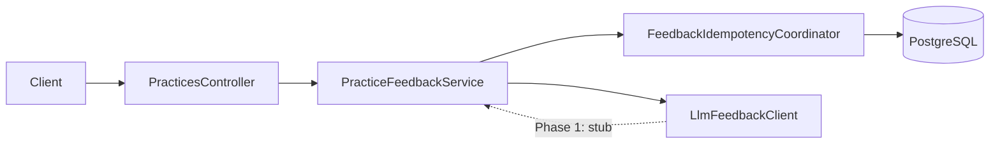

# AI Feedback System – Backend (Phase 1)

This document is the **backend engineering specification** for AI feedback submit, persistence, idempotency, and session progress. It **does not replace** the product PRD; UX, acceptance criteria, and high-level behavior remain authoritative in [`resource/prds/04-ai-feedback-system.md`](../04-ai-feedback-system.md).

**Aligned references:** [Foundation PRD](../00-foundation.md) (shared models), [Practice Session Management – Backend](01-practice-session-management.md) (canonical `practice_id`, create-or-get), [Audio Recording – Backend](03-audio-recording.md) (transcript segments as input to feedback). **Version note:** Tracks product PRD **§4.1** (required `Idempotency-Key`, durable idempotency, timeouts).

---

## 1. Scope

### 1.1 In scope

- `POST /api/v1/practices/{practice_id}/feedbacks` — validation, orchestration, response mapping.
- Persistence of `PracticeFeedback` and `PracticeFeedbackRequest` (idempotency), including `UNIQUE (user_id, idempotency_key)`.
- Server-side **input fingerprint** from persisted whiteboard section JSON + ordered transcript segments.
- Diagram-to-text and merged transcript assembly from persisted state only (no client-supplied diagram or transcript on this endpoint).
- API-only **`grade_label`** / **`grade_color`** derived from stored numeric **`score`** (see §7).
- **`question_ids_with_feedback`** on active practice main load (per product **§2.5**), backed by distinct `question_id` values that have at least one `PracticeFeedback` in the session.

### 1.2 Out of scope / deferred

- Real OpenAI/Anthropic HTTP client (Phase 1 uses **`StubLlmFeedbackClient`** as `@Primary` implementation of **`LlmFeedbackClient`**).
- Async queue-only completion if the product later defers synchronous HTTP response (current design completes in-request after claim).
- Dedicated UI work for numeric score (product: V1 uses label + color only).

---

## 2. Integration overview

**Dependencies**

- **`PracticeRepository.findWithMainAndQuestionById`** — loads `Practice` with `PracticeMain` and `Question` (user id, whiteboard JSON, section index, `requires_recording`).
- **`PracticeTranscriptSegmentRepository.findByPractice_PracticeIdOrderBySegmentOrderAsc`** — ordered segments for fingerprint + transcript text.
- **`PracticeMain.whiteboard_content`** — authoritative diagram JSON; active section selected via `question.whiteboard_section`.
- Canonical **`practice_id`** — obtained via create-or-get in [Practice Session Management – Backend](01-practice-session-management.md).

---

## 3. Data model (backend)

Schema: [`src/main/resources/db/migration/V9__Create_practice_feedback_and_idempotency.sql`](../../../src/main/resources/db/migration/V9__Create_practice_feedback_and_idempotency.sql).

### 3.1 `practice_feedback`

| Column | Notes |
|--------|--------|
| `practice_feedback_id` | PK |
| `practice_id` | FK → `practice` |
| `feedback_text` | LLM output text |
| `score` | `DOUBLE PRECISION`, 0–100 (enforced in grade mapper at response boundary) |
| `generated_at` | Timestamp |

Index: `idx_practice_feedback_practice_id` on `practice_id`.

### 3.2 `practice_feedback_request` (idempotency)

| Column | Notes |
|--------|--------|
| `practice_feedback_request_id` | PK |
| `user_id` | Owner scope (from `practice_main.user_id`) |
| `idempotency_key` | Client-supplied string, max **128** chars (DB + service validation) |
| `practice_id` | FK → `practice` (binds key to this submit target) |
| `input_fingerprint` | SHA-256 hex string (64 chars) over practice id + section JSON + segment material |
| `status` | `CLAIMED` \| `COMPLETED` \| `FAILED` (see [`PracticeFeedbackRequestStatus`](../../../src/main/java/com/hellointerview/backend/entity/PracticeFeedbackRequestStatus.java)) |
| `practice_feedback_id` | Set when `COMPLETED`; cleared on some failure paths |
| `error_code` | e.g. `llm_timeout`, `claim_abandoned` |
| `created_at`, `updated_at`, `expires_at` | `expires_at` default **72h** from row creation if unset ([`PracticeFeedbackRequest`](../../../src/main/java/com/hellointerview/backend/entity/PracticeFeedbackRequest.java) `@PrePersist`) |

**Constraints**

- **`UNIQUE (user_id, idempotency_key)`** — one logical attempt row per user + key.
- Index **`(practice_id, status)`** for operational queries.

**Relationship:** One `Practice` has many `PracticeFeedback` rows (history). The idempotency row is **per submit attempt** (per `Idempotency-Key`), not per `practice_id`.

---

## 4. API specification

**Endpoint:** `POST /api/v1/practices/{practice_id}/feedbacks`  
**Controller:** [`PracticesController`](../../../src/main/java/com/hellointerview/backend/controller/PracticesController.java)  
**Service:** [`PracticeFeedbackService`](../../../src/main/java/com/hellointerview/backend/service/PracticeFeedbackService.java)

### 4.1 Headers

| Header | Required | Rules |
|--------|----------|--------|
| `Idempotency-Key` | **Yes** | Non-empty after trim; max **128** characters. Missing header → **400** (Spring `MissingRequestHeaderException`, mapped by [`GlobalExceptionHandler`](../../../src/main/java/com/hellointerview/backend/exception/GlobalExceptionHandler.java)). Null/blank after trim (e.g. whitespace-only) → **400** via `BadRequestException` in service. |

### 4.2 Body

- **`{}`** or omitted body (empty JSON object).  
- **Non-empty JSON object** → **400** `BadRequestException`: *Request body must be empty for this endpoint*.

### 4.3 Success response

**200 OK** — [`FeedbackSubmitResponseDto`](../../../src/main/java/com/hellointerview/backend/dto/FeedbackSubmitResponseDto.java): `practice_id`, nested `feedback` ([`FeedbackPayloadDto`](../../../src/main/java/com/hellointerview/backend/dto/FeedbackPayloadDto.java): ids, text, numeric `score`, `grade_label`, `grade_color`, `generated_at`), and **`submitted_at`** (currently same instant as persisted feedback `generated_at` per [`FeedbackSubmitResponseMapper`](../../../src/main/java/com/hellointerview/backend/service/feedback/FeedbackSubmitResponseMapper.java)).

### 4.4 Errors (summary)

| HTTP | When | `code` (if any) |
|------|------|-----------------|
| **400** | Missing/blank/oversized `Idempotency-Key`; empty whiteboard section for mapped `section_N`; question `requires_recording` and zero segments; non-empty body; JSON serialization failure for fingerprint input | — |
| **404** | Unknown `practice_id` | — |
| **409** | Idempotency conflict: wrong `practice_id` for key, expired key, fingerprint mismatch on completed/in-flight row per coordinator rules | — |
| **503** | In-flight same key + fingerprint (`FeedbackInProgressException`) | `feedback_in_progress`; **`Retry-After`** header (seconds) |
| **503** | LLM outbound timeout (`LlmTimeoutException`) | `llm_timeout` |

Error envelope: [`ErrorResponse`](../../../src/main/java/com/hellointerview/backend/exception/ErrorResponse.java) — `error`, `message`, optional `code`, optional `details`.

---

## 5. Core processing flow

Ordered steps in **`PracticeFeedbackService.submitFeedback`**:

1. **Normalize `Idempotency-Key`** (fail fast before DB reads for null/blank).
2. **Load practice** — 404 if missing.
3. **Load transcript segments** for `practice_id`, ordered.
4. **`validateRecordingIfRequired`** — if `question.requiresRecording` and no segments → 400.
5. **Resolve whiteboard section** — `section_{whiteboardSection}` on `PracticeMain.whiteboard_content`; **empty `elements` list** → 400.
6. **Fingerprint** — [`FeedbackInputFingerprint.compute`](../../../src/main/java/com/hellointerview/backend/service/feedback/FeedbackInputFingerprint.java) over `practice_id`, canonical JSON of the section map, and each segment’s order, duration, and transcript text hash code.
7. **Diagram text** — [`DiagramToTextConverter.diagramToText`](../../../src/main/java/com/hellointerview/backend/service/feedback/DiagramToTextConverter.java) on the section map.
8. **Combined transcript** — [`TranscriptAggregation.buildCombinedTranscript`](../../../src/main/java/com/hellointerview/backend/service/TranscriptAggregation.java).
9. **Build `LlmFeedbackInput`** — question type label, description, diagram text, transcript.
10. **Idempotency** — [`FeedbackIdempotencyCoordinator.claimOrInsert`](../../../src/main/java/com/hellointerview/backend/service/feedback/FeedbackIdempotencyCoordinator.java) (short transaction).
11. **Branch on claim result** — `Replay` → return DTO; `Conflict` → 409; `InProgress` → 503 + retry-after; `Proceed` → call LLM.
12. **LLM** — **`LlmFeedbackClient.generate`** **outside** a transaction holding the claim (claim already committed).
13. **Finalize** — `finalizeSuccessful` writes `PracticeFeedback` and marks request `COMPLETED` in a **separate** transaction from the claim insert (per product **§4.1.2**).

### 5.1 Idempotency state machine (implementation)

Implemented in **`FeedbackIdempotencyCoordinator`**:

- **New key:** insert row `CLAIMED` with fingerprint; unique violation → reload and **`handleExisting`** (concurrent first insert).
- **`COMPLETED` + same fingerprint:** return **`Replay`** (DTO from linked `PracticeFeedback`, no LLM).
- **`COMPLETED` + different fingerprint:** **`Conflict`**.
- **`CLAIMED` + stale** (created older than **15 minutes**, constant `STALE_CLAIM_AFTER_MINUTES`): transition to **`FAILED`** / `claim_abandoned`, then continue evaluation.
- **`CLAIMED` + same fingerprint:** **`InProgress`** → 503 `feedback_in_progress`.
- **`FAILED` + same fingerprint:** reclaim — set `CLAIMED`, clear error, return **`Proceed`** with same request id so LLM can run again.

**Transactions:** Claim insert and finalize/fail updates use `@Transactional` on coordinator methods; LLM call is **not** wrapped with those transactions.

---

## 6. Grading and response mapping

- **Storage:** `practice_feedback.score` only.
- **API:** [`FeedbackGradeMapper.fromScore`](../../../src/main/java/com/hellointerview/backend/service/feedback/FeedbackGradeMapper.java) produces `grade_label` and `grade_color` for [`FeedbackPayloadDto`](../../../src/main/java/com/hellointerview/backend/dto/FeedbackPayloadDto.java). Bands (floor of score): 0–19, 20–39, 40–59, 60–79, 80–100 with labels/colors defined in code (align with product **§2.4** for UX; exact strings are code-owned).

---

## 7. Progress integration

**Field:** `question_ids_with_feedback` on **`GET`** practice main (see [Practice Session Management – Backend](01-practice-session-management.md)).

**Implementation:** [`PracticeMainService.getQuestionIdsWithFeedback`](../../../src/main/java/com/hellointerview/backend/service/PracticeMainService.java) delegates to [`PracticeFeedbackRepository.findDistinctQuestionIdsWithFeedbackByPracticeMainId`](../../../src/main/java/com/hellointerview/backend/repository/PracticeFeedbackRepository.java) — JPQL `distinct` `question_id` for all `PracticeFeedback` whose `practice.practiceMain` matches the session. Matches product **§2.5** (dot counts feedback received, not draft-only state).

---

## 8. LLM integration (Phase 1 vs future)

| Piece | Role |
|--------|------|
| [`LlmFeedbackClient`](../../../src/main/java/com/hellointerview/backend/service/feedback/LlmFeedbackClient.java) | Interface: `generate(LlmFeedbackInput)` may throw **`LlmTimeoutException`**. |
| [`StubLlmFeedbackClient`](../../../src/main/java/com/hellointerview/backend/service/feedback/StubLlmFeedbackClient.java) | `@Primary` Phase 1 bean: deterministic stub text + score **85.5**. |
| **Future** | Swap in a provider client bean; keep timeout → `LlmTimeoutException` → `markRequestFailed(..., "llm_timeout")` + **503** `llm_timeout`. |

---

## 9. Operational and testing notes

- **Service tests:** [`PracticeFeedbackServiceTest`](../../../src/test/java/com/hellointerview/backend/service/PracticeFeedbackServiceTest.java) — claim replay, proceed/finalize, conflict, in-progress, LLM timeout + failed row, validation paths.
- **Controller tests:** [`PracticesControllerTest`](../../../src/test/java/com/hellointerview/backend/controller/PracticesControllerTest.java) — body rules, required header, happy path wiring with `GlobalExceptionHandler`.
- **Local JDK 25 + Mockito:** Surefire sets **`-Dnet.bytebuddy.experimental=true`** ([`pom.xml`](../../../pom.xml)) so inline mocks work; document for maintainers running `mvn test`.

---

## 10. Cross-link maintenance

When changing feedback HTTP contract or idempotency rules, update **this file** and the product PRD [**§4**](../04-ai-feedback-system.md) together. Related backend docs: [01](01-practice-session-management.md), [03](03-audio-recording.md).
